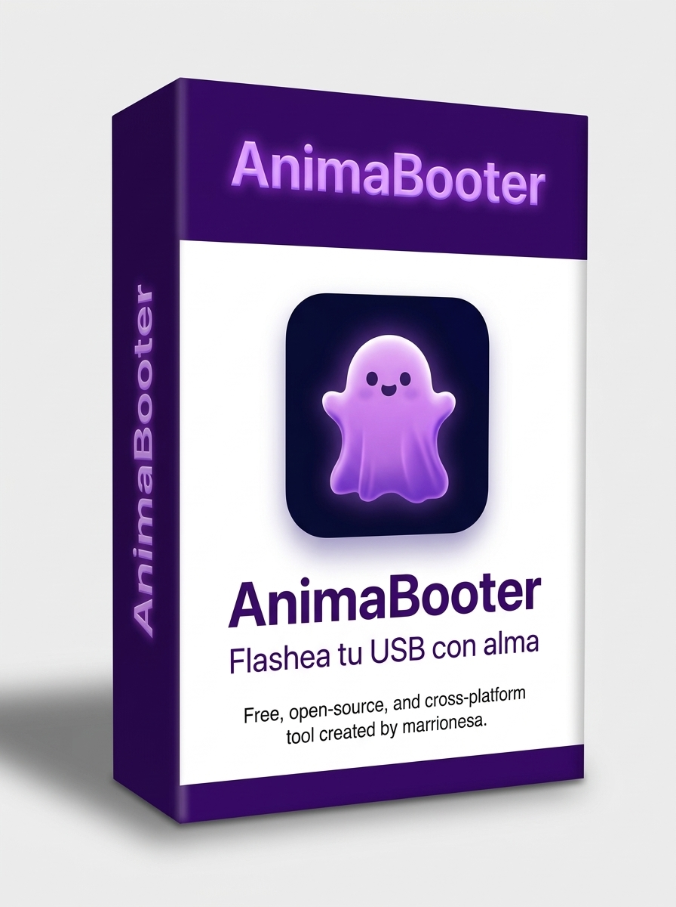

<div align="center">



# animabooter-website

**The official website of [AnimaBooter](https://github.com/marrionesa/animabooter) — flash USB drives with soul.**

[](https://github.com/marrionesa/animabooter/releases)
[](LICENSE)
[](https://nextjs.org)
[](https://www.typescriptlang.org)
[](https://tailwindcss.com)
[](https://ui.shadcn.com)

</div>

---

This repository contains **only the website** that presents the AnimaBooter project.
The application itself lives in the main repository:

> **[`marrionesa/animabooter`](https://github.com/marrionesa/animabooter)** — a tiny, honest,
> open-source, cross-platform USB image flasher built with Rust + Tauri 2 + Svelte 5.
> Releases, changelog, contributing guide and security policy all live there.

## About the site

A single-page, dark-themed presentation site for AnimaBooter:

- **Hero** with the project pitch, tech badges and direct download CTA
- **Pipeline** — the parallel 3-stage flash engine (reader → writer → verifier)
- **Features** — real, verified capabilities only (no invented claims)
- **Screenshots** — actual captures from the v0.1.0 release, served from [`public/screenshots/`](public/screenshots)
- **Download** — links to the real bundles of the [v0.1.0 release](https://github.com/marrionesa/animabooter/releases/tag/v0.1.0) (Windows NSIS/MSI, macOS `.dmg`, Linux AppImage/`.deb`/`.rpm`)
- **Compare** — factual architecture comparison with Etcher, Rufus and usbimager
- **Verification status** — honest table of what is hardware-tested
- **Roadmap & build-from-source** — mirrored from the main repository

## Tech stack

- [Next.js](https://nextjs.org) 16 (App Router) + React + TypeScript
- [Tailwind CSS](https://tailwindcss.com) v4 + [shadcn/ui](https://ui.shadcn.com) components
- Icons by [Lucide](https://lucide.dev)

## Getting started

Requires Node.js ≥ 18 (or [Bun](https://bun.sh)). This repo uses Bun, but any
Node-compatible package manager works.

```bash
bun install        # or: npm install
bun run dev        # dev server on http://localhost:3000
```

### Production

```bash
bun run build      # next build → standalone output + static assets
bun run start      # serves .next/standalone/server.js on port 3000
bun run lint       # eslint
npx tsc --noEmit   # type check
```

The included [`Caddyfile`](Caddyfile) is a minimal reverse-proxy setup that
forwards traffic to `localhost:3000` for self-hosting behind Caddy.

## Project structure

```text
src/app/                 App Router: page.tsx (the whole landing page), layout.tsx
src/components/ui/       shadcn/ui component library
src/hooks/               shared React hooks
public/screenshots/      real AnimaBooter captures (from the main repository)
Caddyfile                self-hosting reverse proxy
```

## Contributing

Website improvements are welcome — open an issue or PR here. For the
application itself (bugs, features, hardware testing), please use the
[main repository](https://github.com/marrionesa/animabooter) and read its
[contributing guide](https://github.com/marrionesa/animabooter/blob/main/CONTRIBUTING.md)
and [security policy](https://github.com/marrionesa/animabooter/blob/main/SECURITY.md).

## License

[MIT](LICENSE) © [marrionesa](https://github.com/marrionesa)
